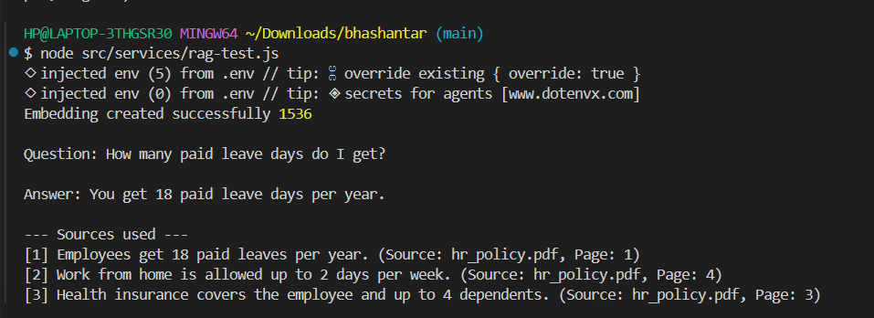
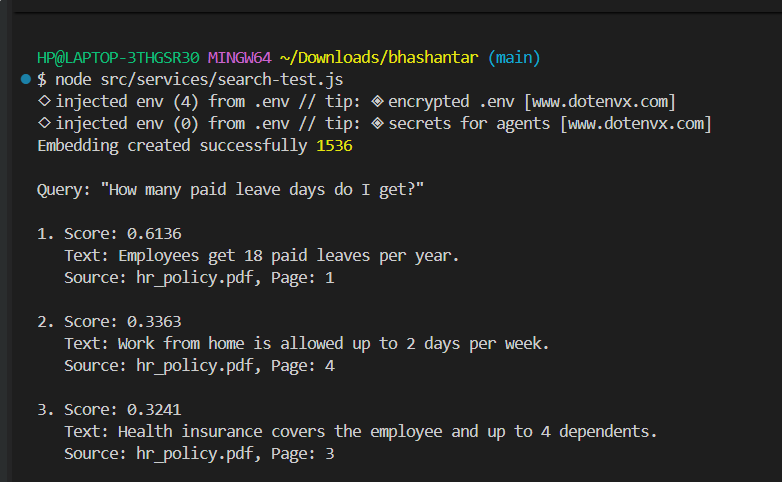

## Progress Logs
```
## Day 1 :


- **Embedding service working** — connected to OpenRouter (OpenAI-compatible API) using
  `openai/text-embedding-3-small`. Confirmed vector output length = **1536**.
- **Qdrant running locally** via Docker (`docker run -p 6333:6333 -p 6334:6334 ...`),
  dashboard verified at `http://localhost:6333/dashboard`.
- **Collection created** — `bhashantar_documents`, vector size `1536`, distance metric `Cosine`.

**Key decisions made:**
- Using OpenRouter instead of OpenAI directly, for unified API access.
- Cosine similarity chosen over Euclidean/Dot — correct choice for text embeddings
  since OpenAI's model outputs are direction-based, not magnitude-based.


**Next up:**
-  Insert 3–5 chunks manually into the collection
-  Run a similarity search against them
-  Connect retrieved chunks to the LLM (first RAG round-trip)
```

```
### Day 2 — Core RAG loop working ✅

Full pipeline confirmed end-to-end:
question → embed (OpenRouter) → retrieve (Qdrant) → LLM answers using
only retrieved context → source cited.

Test query: "How many paid leave days do I get?"
→ Correctly answered using only the relevant chunk, ignored unrelated
  retrieved chunks (WFH, insurance).

**Next up:** PDF ingestion — replace hand-typed test chunks with real
document chunking + upload.
```



